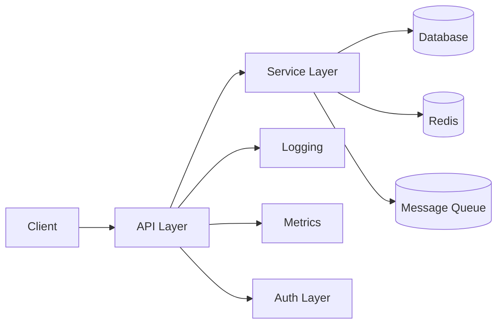
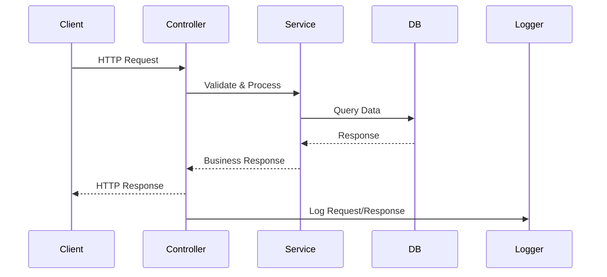
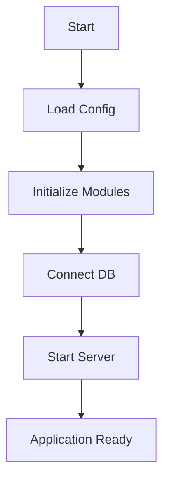
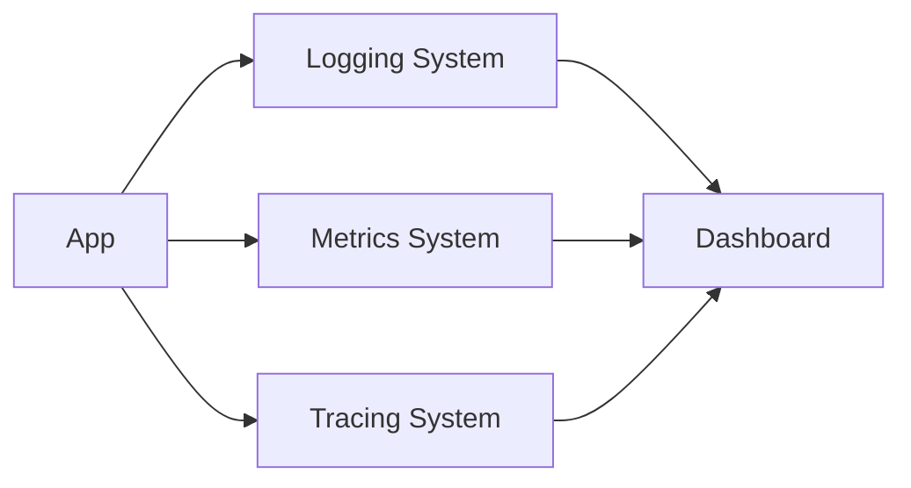
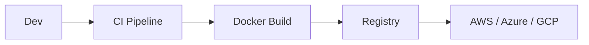

  

<h1 align="center">🚀 Thynqit NodeJS Accelerator</h1>

<b>Enterprise Backend Architecture Blueprint</b>

  
  
  
  

---

## ⚠️ Usage & Licensing Notice

This repository is **public for reference purposes only**.

- 🚫 Forking is discouraged  
- 🚫 External contributions are not accepted  
- 🚫 Commercial or production use is not permitted  
- ✅ Intended for understanding Thynqit's engineering practices  

For collaboration or usage inquiries, please contact Thynqit at connect@thynqit.com.

---

## 📌 Table of Contents

- [Overview](#-overview)
- [Why This Matters](#-why-this-matters)
- [Business Impact](#-business-impact)
- [Core Principles](#-core-principles)
- [Architecture](#-architecture)
- [Request Flow](#-request-flow)
- [Application Flow](#-application-flow)
- [System Components](#-system-components)
- [Functional Capabilities](#-functional-capabilities)
- [Security Architecture](#-security-architecture)
- [Observability Architecture](#-observability-architecture)
- [Testing Strategy](#-testing-strategy)
- [Deployment Architecture](#-deployment-architecture)
- [Project Structure](#-project-structure)
- [Versioning](#-versioning)
- [Future Enhancements](#-future-enhancements)
- [Who Should Use This](#-who-should-use-this)
- [Contributing](#-contributing)
- [License](#-license)

---

## 📌 Overview

The **Thynqit NodeJS Accelerator** is an enterprise-grade backend blueprint designed to standardize how scalable, secure, and production-ready backend systems should be designed, structured, built and deployed.

Unlike typical boilerplates, this accelerator focuses on:

- ⚡ Rapid development enablement  
- 🏗️ Scalable architecture patterns  
- 🔒 Security-first design  
- ☁️ Cloud-native readiness  
- 📊 Observability and reliability   

---

## 🎯 Why This Matters

Modern backend systems fail not because of code—but because of poor foundations and architectural decisions.

This accelerator ensures:

- ✅ Consistent architecture across projects  
- ✅ Faster onboarding of developers  
- ✅ Engineering best practices
- ✅ Reduced technical debt  
- ✅ Production readiness from Day 1  

---

## 💼 Business Impact

Using this accelerator delivers measurable outcomes:

- 🚀 70–80% faster project kickoff
- 💰 Reduced development cost
- 📉 Lower production incidents
- 👨‍💻 Faster developer onboarding
- 🏗️ Consistent delivery quality across teams

---

## 🧱 Core Principles

It represents the foundational architectural guidelines that shape how every system built using this accelerator is designed and evolved. They ensure a consistent, predictable, and scalable approach from the outset, reducing ambiguity in engineering decisions as systems grow in complexity.

### Best Practices
- Modular Architecture  
- Dependency Injection  
- Config-Driven Systems (12-Factor App)  
- Stateless Services  
- API-First Design  
- Observability by Default  
- Security by Design  

---

## 🏗️ Architecture

High-Level Architecture defines the overall structural blueprint of the system by organizing it into clearly separated layers such as API, service, and data. This layered approach establishes clear boundaries of responsibility, ensuring that each part of the system can evolve independently without unintended side effects on others. By enforcing this structure, the accelerator enables scalability, maintainability, and flexibility, allowing teams to adapt to changing requirements, integrate new capabilities, and scale individual components without disrupting the entire system.

### Best Practices
- Layered architecture  
- Dependency Injection  
- Stateless services 

---

## 🔁 Request Flow

Request Flow defines the standardized lifecycle of how an incoming request moves through the system—from the API layer to services, data access, and back as a response. Establishing a consistent flow ensures predictable behavior across all endpoints, making the system easier to debug, monitor, and optimize. By structuring how requests are validated, processed, and logged, it enhances traceability, improves performance tuning, and reduces the risk of inconsistent implementations across teams.

### Best Practices
- Thin controllers  
- Business logic in services  
- Structured logging  

---

## 🔄 Application Flow

Application Flow defines the startup lifecycle of the system, outlining how configurations are loaded, dependencies are initialized, and the application is brought to a ready state. By standardizing this sequence, the accelerator ensures consistent and predictable behavior across different environments such as development, staging, and production. This structured initialization reduces runtime failures, improves reliability, and ensures that all critical components are properly validated and available before the system begins handling requests.

### Best Practices
- Config validation  
- Graceful startup  
- Dependency initialization

---

## 🧩 System Components

### API Layer  

The API Layer serves as the entry point for all external interactions, responsible for receiving incoming requests, validating input, and routing them to the appropriate services. It ensures that only well-formed and authorized requests enter the system, maintaining consistency across all endpoints. By keeping this layer focused solely on request handling and delegation, it enables cleaner architecture and easier evolution of APIs through practices such as DTO-based validation and versioning.

#### Components
- Controllers
- DTO Validation
- Interceptors
- Versioning

### Service Layer  

The Service Layer encapsulates the core business logic of the application, acting as the central point where domain rules, workflows, and processing are implemented. It separates business concerns from request handling, ensuring that logic remains reusable, testable, and independent of external interfaces. This layer promotes maintainability and scalability by following principles like single responsibility and modular design, allowing complex systems to evolve without tightly coupling components.

#### Responsibilities
- Business Logic
- Data Processing
- External Integrations

### Data Layer  

The Data Layer manages all interactions with persistence systems, abstracting database operations and shielding the rest of the application from underlying storage complexities. It provides a consistent interface for working with both SQL and NoSQL databases, enabling flexibility in choosing the right data store for different use cases. By leveraging ORMs/ODMs, enforcing schema consistency, and supporting migrations, this layer ensures reliable data access, integrity, and long-term maintainability.

#### Components
- SQL (Prisma)
- NoSQL (MongoDB)
- Migrations

### Cross-Cutting Concerns

Cross-Cutting Concerns represent shared capabilities that span across all layers of the system, ensuring consistency, reliability, and operational excellence. These include structured logging for end-to-end request traceability, metrics collection for real-time performance monitoring, and distributed tracing to understand system behavior across services. Security to enforce, protection of the application from common vulnerabilities. Additionally, caching is incorporated to improve performance and reduce load on underlying systems. Together, these capabilities provide deep visibility, stronger security, and optimized performance, making the system production-ready by default.

#### Responsibilities
- Logging (Pino, Correlation IDs)
- Metrics (Prometheus)
- Tracing (OpenTelemetry)
- Security (Helmet, Guards)
- Caching (Redis)

---

## ⚙️ Functional Capabilities

The accelerator provides a well-defined set of core capabilities that collectively establish a strong, production-ready foundation for backend systems. By standardizing key aspects across development, deployment, and operations, it ensures consistency, reliability, and scalability, enabling teams to move faster while maintaining high engineering quality and reducing operational risks.

### Capabilities
| Capability | Description | Impact |
|------------|-------------|--------|
| Environment | Multi-env support (dev, qa, prod) | Stability |
| Configuration | Centralized & validated config | Flexibility |
| Logging | Structured logging + correlation IDs | Faster RCA |
| APIs | REST-ready + Swagger | Faster dev |
| Database | SQL + NoSQL | Scalability |
| Containerization | Docker-ready | Easy deploy |
| Testing | Unit + Integration | Fewer bugs |
| CI/CD | GitHub Actions / Jenkins | Faster release |
| Cloud | AWS / Azure / GCP | Cloud agnostic |

---

## 🔐 Security Architecture

The accelerator embeds security as a foundational layer across the system, ensuring that protection mechanisms are integrated from the ground up rather than treated as an afterthought. It establishes a consistent, layered security model that safeguards every interaction point—covering request validation, access control, and traffic management—so that applications built on top inherit secure defaults. This approach reduces the risk of vulnerabilities, enforces standard security practices across teams, and enables systems to scale without compromising on safety or compliance.

### Best Practices
- Defense in depth  
- Rate limiting  
- Input validation  

---

## 📊 Observability Architecture

The accelerator integrates observability as a core capability, ensuring that every system built on top has built-in visibility into its behavior and performance. By standardizing the collection and correlation of logs, metrics, and traces, it enables teams to monitor applications in real time, diagnose issues quickly, and make data-driven optimizations. This proactive approach reduces downtime, improves system reliability, and ensures that production environments remain transparent and manageable as they scale.

### Best Practices
- Centralized logging  
- Metrics dashboards  
- Distributed tracing  

---

## 🧪 Testing Strategy

The accelerator embeds a robust testing strategy as a core part of the development lifecycle, ensuring that reliability and quality are built into every system from the start. By standardizing testing practices across projects, it enables teams to validate functionality early, catch regressions quickly, and maintain confidence in every release. This approach reduces production risks, improves code quality, and supports faster, safer deployments as systems evolve.

### Best Practices
- Unit Testing (Jest) for logic
- Integration Testing for flows
- Mocking external dependencies

---

## ☁️ Deployment Architecture

The accelerator defines a standardized deployment architecture that streamlines the journey from code to production, ensuring consistency across environments and projects. By embedding deployment practices into the foundation, it enables teams to deliver changes reliably and repeatably without manual intervention. This approach minimizes release risks, improves operational efficiency, and allows systems to scale seamlessly across different cloud platforms.

### Best Practices
- CI/CD pipelines  
- Docker builds  
- Environment configs  

---

## 📂 Project Structure

The accelerator follows a well-organized, modular project structure designed to separate concerns and enable scalability across all layers of the application. Documentation and reusable templates are maintained independently to standardize development practices, while the src directory is structured into clearly defined layers such as constants, configuration, shared utilities, core infrastructure, services, domain modules, database integrations, and testing. This separation ensures that each component has a single responsibility, making the system easier to navigate, extend, and maintain, while supporting multiple interaction patterns such as REST, GraphQL, and WebSockets within a consistent architectural framework.

    docs/
    │   ├── constant/           # Constant files documentation
    │   ├── config/             # Config files documentation
    │   ├── common/             # Common modules documentation
    │   ├── core/               # Core modules documentation
    │   ├── services/           # Services modules documentation
    │   ├── modules/            # Modules classes documentation
    │   ├── database/           # Database modules documentation
    │   └── test/               # Test modules documentation     
    templates/
    │   ├── env/
    │   │   ├── env.template    # Empty env file with only Keys
    │   │   ├── env.local       # Env file with local configuration values
    │   ├── api-spec/
    │   │   ├── markdown.md     # Empty api spec template in markdown format
    │   └── db-schema/
    │       ├── sql.xlsx        # Empty SQL schema template
    │       └── no-sql.xlsx     # Empty NoSQL schema template
    src/
    ├── constant/               
    │   ├── constants.ts        # Global constants
    │   ├── database.ts         # Database constants consisting ENUMS
    │   └── error-code.ts       # API application specific error codes
    ├── config/                 
    │   └── env.ts              # .env wrapper
    ├── common/                 
    │   ├── utils/              # Global utils
    │   ├── decorators/         # Global decorators
    │   ├── filters/            # Global filters
    │   ├── pipes/              # Global pipes
    │   ├── guards/             # Global guards
    │   └── exceptions/         # Global exceptions 
    ├── core/                   
    │   ├── logger/             # Logger module
    │   ├── caching/            # Caching module
    │   ├── middleware/         # Middleware module
    │   └── interceptors/       # Interceptor module
    ├── services/
    │   ├── rest/               # REST API configuration and routes
    │   ├── graphql             # GraphQL endpoints and schema
    │   └── websockets          # WebSockets endpoints
    ├── modules/
    │   ├── country/            # Domain: Country
    │   │   ├── country.module.ts
    │   │   ├── country.service.ts
    │   │   ├── country.controller.ts           <-- Only REST
    │   │   ├── entities/
    │   │   └── dto/
    │   ├── user/               # Domain: User
    │   │   ├── user.module.ts
    │   │   ├── user.service.ts
    │   │   ├── user.resolver.ts                <-- Only GraphQL
    │   │   ├── entities/
    │   │   └── inputs/
    │   └── config-push/        # Domain: Messaging
    │       ├── messaging.module.ts
    │       ├── messaging.service.ts
    │       └── messaging.gateway.ts          <-- Only WebSockets
    ├── database/
    │   ├── sql/                # SQL database classes
    │   └── no-sql/             # NoSQL database classes
    ├── test/
    │   ├── unit/               # Unit tests classes
    │   └── integration         # Integration tests classes    
    ├── .env
    ├── .gitignore
    ├── package.json
    ├── tsconfig.json
    ├── README.md
    ├── .prettierrc
    ├── .eslintrc
    ├── main.ts
    └── app.module.ts

---

## 🔄 Versioning

Versioning is standardized across the accelerator using Semantic Versioning (SemVer) for releases and explicit API versioning (e.g., /v1, /v2) to ensure backward compatibility. In addition, database versioning is enforced for both SQL and NoSQL systems through controlled schema evolution and migration strategies, enabling safe and consistent data changes across environments.

### Best Practices
- Semantic Versioning (SemVer)  
- API Versioning (/v1, /v2)
- SQL Database Versioning
- NoSQL Schema Versioning

---

## 🚀 Future Enhancements

This section outlines planned capabilities to further strengthen the accelerator’s flexibility and developer experience. As the platform evolves, these enhancements will enable broader communication patterns, improved automation, and faster project scaffolding—ensuring the accelerator continues to meet the demands of modern, scalable systems.

- gRPC Support
- CLI Generator

---

## 👥 Who Should Use This

- Startups building scalable backend systems
- Enterprises modernizing architecture
- Engineering teams seeking consistency

---

## 🤝 Contributing

This repository is part of Thynqit’s internal engineering accelerator and is shared publicly for reference and knowledge sharing purposes only.

We do not accept external contributions, pull requests, or forks for this project.

However, we welcome:

- Discussions around architecture and engineering practices
- Collaboration opportunities
- Partnership or licensing inquiries

If you’re interested in working with Thynqit or learning more about our engineering approach, feel free to reach out.

---

## 📜 License

This project is licensed under a **Proprietary License (All Rights Reserved)**.

You may:
- View and reference the material

You may NOT:
- Copy, modify, distribute, or use in production without explicit permission

---

## 🌐 About Thynqit

Thynqit builds scalable, AI-powered, and cloud-native digital solutions with a strong focus on engineering excellence.
